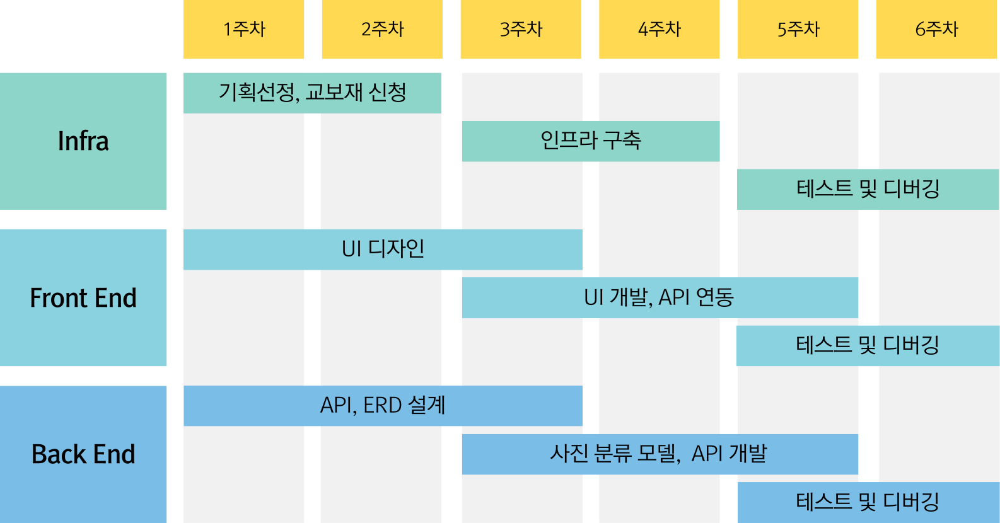

# 채움과 비움 _ **채비** | A309

## 조원(역할)
    석준영(조장, AI), 정해준(BE), 이윤하(FE),
    박수진(FE, 디자인), 권주안(FE), 박창빈(FE)

## 기술 스택 

**BackEnd**  

  

**FrontEnd_APP**  

  

**FrontEnd_WEB**  

  

**DBMS**  

  

**Infra**  

  

**API**  

## 서비스 설명  
예치금을 걸고 금융 목표에 도전하는 SOL인앱 챌린지 서비스

예치금을 걸고 다양한 금융 챌린지에 도전하여 상금을 분배받는다 ~
사용자의 이체 내역을 자동 추적하여 별도의 인증이 필요없습니다 !!!!

## 기능 소개

### **✒ 기록**

'유언'에서 느껴지는 무게감과 심리적 부담감을 줄이며  
손쉬운 편지와 갤러리 형식의 가벼운 기록

●
    📃 남기기

    열람인에 따라 개별적인 메시지를 남길 수 있고,
    메모장처럼 편리하게 작성할 수 있습니다.

●
    🖼 채우기

    직관적으로 열람할 사람을 분류하고
    한번에 여러장의 사진을 채울 수 있습니다.
  
  
  
### **📫 전달**

친구 등 남에게 맞긴 편지와 같이 전달의 불확실성에서 벗어나  
열람인에게 확실한 유언 전달

●
    📱 FCM을 응용한 Push 알림

    장기 미방문 시 사용자 휴대폰으로 알림을 보내
    유족이 기록을 확인하도록 유도합니다.  

●
    📩 부고 SMS 캐칭

    사용자에게 회사 번호를 저장하게 하여
    부고문자가 도달될 시 기록을 전달합니다.
  
  
### **📜 열람**

하나의 유언장에 적혀있는 메시지에서 벗어나  
수신인 개인에 맞춘 메시지 전달

●
    📱 FCM을 응용한 Push 알림

    두 단계로 이루어진 인증(OTP 형식의 보안코드 / 암호질문)을  
    거쳐 등록된 메시지를 확인할 수 있습니다.

●
    📱 FCM을 응용한 실시간 알림 / Slack Message

    CLIPModel을 활용하여 이미지로부터 추출한 텍스트 키워드와  
    메타데이터의 위치 정보를 바탕으로 사진을 큐레이팅합니다.

## 설계

### 아키텍처

### 개발 일정

### ERD

### 서비스
[서비스 링크](http://k11a309.p.ssafy.io/)

### 설치 가이드
[링크](exec/포팅메뉴얼_채비.md)